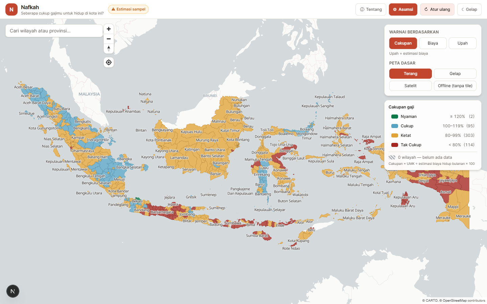

# Nafkah — Peta Kecukupan Gaji vs Biaya Hidup Indonesia

[](https://github.com/adenaufal/nafkah/actions/workflows/ci.yml)
[](LICENSE)
[](LICENSE-DATA.md)



Peta interaktif yang membandingkan upah minimum daerah (UMK/UMP) dengan estimasi
biaya hidup bulanan di **514 kabupaten/kota** Indonesia. Menjawab satu
pertanyaan: *"apakah upah minimum di daerah ini cukup untuk hidup di sana?"*

> **Angka biaya hidup adalah estimasi model, bukan survei primer** — dilabeli
> jelas di UI. Upah bersumber dari penetapan resmi 2026. Bukan nasihat keuangan.
> Detail di [Integritas & audit data](#integritas--audit-data).

Live: **[nafkah.adenaufal.com](https://nafkah.adenaufal.com)**

## Fitur (v0.1)

- **Peta choropleth 514 kab/kota** — diwarnai band keterjangkauan (Nyaman /
  Cukup / Ketat / Tak Cukup), palet colorblind-aware; wilayah tanpa data pakai
  pola arsir (hatch), bukan hanya warna.
- **Panel asumsi** — rumah tangga (single/pasangan/keluarga), gaya hidup,
  hunian, transport, sertakan tabungan, basis upah (kotor / take-home).
- **Pendapatan sendiri** — masukkan gaji sendiri untuk skenario relokasi; opsi
  "2 upah" untuk pasangan bekerja. UMK daerah tetap tampil sebagai pembanding.
- **Baki perbandingan** — sematkan hingga 5 wilayah, breakdown biaya per
  kategori (grafik batang bertumpuk).
- **Modal detail** — rincian per kategori dengan `source` / `asOf` /
  `confidence` tiap sel, plus grafik.
- **Basemap** — Terang / Gelap / Satelit (keyless) + mode Offline (tanpa tile).
- **Dark mode**, pencarian wilayah, legenda numerik + filter per band.
- **Aksesibilitas** — navigasi keyboard, `aria` label, kontras AA.

## Stack

- Next.js 15 (App Router, static export) + TypeScript + Tailwind CSS v4
- MapLibre GL JS (client-only via `next/dynamic`, `ssr: false`)
- Basemap keyless: CARTO Positron / Dark Matter (OSM-derived) + Esri World Imagery
- Recharts (hanya di modal detail & baki perbandingan)
- Geometri: HDX COD-AB Indonesia adm2, disederhanakan ke TopoJSON (≈0.6 MB)
- Deploy: Cloudflare Workers Static Assets

## Menjalankan

```bash
npm install
npm run dev        # http://localhost:3000
npm run build      # static export ke ./out
npm run typecheck
npm test           # unit test kalkulasi (vitest)
```

## Model asumsi & formula

Profil baseline: `single · moderate · studio · motorcycle · savings included`.
Household / lifestyle / housing / transport adalah tabel multiplier per kategori
(data, bisa diedit) di `src/data/multipliers.ts`.

```text
totalMonthlyCost   = Σ nilai kategori aktif di bawah asumsi saat ini
wageBasisAmount    = earners × (wageBasis === 'gross' ? grossMonthly : estimatedTakeHome)
                       earners = 2 jika pasangan bekerja (default 1)
  dengan pendapatan sendiri (customIncome > 0):
    wageAmount     = customIncome + (earners === 2 ? upah daerah 1 pekerja : 0)
coveragePercent    = wageBasisAmount / totalMonthlyCost × 100
surplusOrDeficit   = wageBasisAmount − totalMonthlyCost
affordabilityRatio = totalMonthlyCost / wageBasisAmount
```

Band (konstanta di `src/lib/calculations.ts`):
`Nyaman ≥ 120% · Cukup 100–119% · Ketat 80–99% · Tak Cukup < 80%`.

## Data & provenance

Setiap angka membawa `source`, `asOf`, dan `confidence`. Tangga keterpercayaan:
`sample` → `estimate` (dimodelkan dari agregat BPS) → `official` (dataset resmi).
UI menampilkan badge "Estimasi sampel" untuk apa pun di bawah `official`.

**Cara mengganti data (tanpa ubah kode):**

- **Upah** — edit `src/data/provinces/<provinsi>.ts`. Ganti `grossMonthly`
  dengan UMK resmi, set `confidence: "official"`, isi `source` (nama + nomor SK)
  dan `asOf`. Field take-home tetap dilabeli estimasi.
- **Biaya** — edit `src/data/costs.ts`. Tiap sel kategori punya
  `source`/`asOf`/`confidence` sendiri, jadi satu wilayah bisa punya upah
  `official` tapi sewa `sample`.
- **Wilayah** — tambah baris di `src/data/regions.ts` (kode wilayah, centroid,
  tier) + baris upah/biaya + narasi di `src/data/narratives.ts`.
- **Go live** — `src/data/loader.ts` mengembalikan `Map<kode, record>`; ganti
  `loadRecords` dengan panggilan API dengan bentuk return yang sama.

Kunci join: pcode HDX `ID3173` → kode wilayah `31.73` (lihat
`pcodeToKodeWilayah` di `src/lib/geometry.ts`).

## Penyiapan geometri (perintah persis)

Aset `public/data/regions.topojson` (≈0.6 MB, 514 wilayah) dihasilkan dari
dataset HDX COD-AB Indonesia:

```bash
# 1. Unduh (zip 436 MB → idn_admin2.geojson 143 MB; adm2 = kabupaten/kota)
curl -L -o idn_admin_boundaries.geojson.zip \
  "https://data.humdata.org/dataset/84a1d98a-790b-4d66-9d14-bbfa48500802/resource/e1421da4-8f48-47d2-ac49-79ff5bfa4d24/download/idn_admin_boundaries.geojson.zip"
unzip idn_admin_boundaries.geojson.zip   # -> idn_admin2.geojson

# 2. Sederhanakan ke TopoJSON < 2 MB (hasil ≈ 0.6 MB)
npx mapshaper idn_admin2.geojson \
  -filter-fields adm2_name,adm2_pcode,adm1_name,adm1_pcode \
  -simplify 2% keep-shapes -clean \
  -o format=topojson quantization=10000 regions.topojson

# 3. Pasang
cp regions.topojson public/data/regions.topojson
```

Untuk ganti sumber: ganti file dan sesuaikan `topologyToFeatureCollection` bila
nama propertinya beda.

## Integritas & audit data

**Cakupan:** tepat **514 kabupaten/kota definitif** (416 Kabupaten + 98 Kota)
di 38 provinsi, sesuai Kepmendagri No. 100.1.1-6117.

- **Pembersihan 8 poligon non-administratif.** Geometri HDX awal memuat 8
  poligon badan air/hutan (`12.88` Danau Toba, `13.88` Singkarak/Maninjau,
  `16.88` Ranau, `18.88` Danau Lampung, `32.88` Waduk Cirata, `33.88`
  Kedungombo, `33.99` Hutan Lindung Jateng, `71.88` Tondano) — semuanya
  difilter di modul geometri.
- **Upah — resmi 2026.** Seluruh 514 baris memakai UMP/UMK 2026 (berlaku 1
  Januari 2026, per PP No. 49/2025). 245 daerah pakai UMK mandiri dari
  SK/Kepgub Desember 2025; 269 lainnya menginduk UMP provinsi (fallback
  eksplisit berlabel). Daftar UMP 38 provinsi dirilis Kemnaker 6 Januari 2026.
- **Biaya hidup — model estimasi.** 10 kategori dimodelkan dari agregasi
  Susenas, IHK BPS, dan benchmark pasar lokal — **bukan** survei primer per
  kabupaten (BPS hanya menggelar Survei Biaya Hidup di kota sampel IHK). Semua
  dilabeli `confidence: "estimate"`; disesuaikan inflasi (IHK yoy Juli 2026
  +2,88%), `asOf` 2026-08-01.
- **Anti-halusinasi sitasi.** Deskripsi sumber dinormalisasi ke metodologi yang
  jujur; nama survei fiktif dihilangkan; sumber ber-indikasi konten SEO
  halusinasi ditolak dan didokumentasikan di `data-prep/wages-2026-research.json`.
- **Wilayah frontier (Papua & non-IHK).** Daerah pedalaman/kepulauan (Keerom,
  Sarmi, Mamberamo Raya, Pegunungan Arfak, dll.) tidak punya SBH primer;
  pengeluaran dimodelkan dari Susenas perdesaan + biaya logistik perintis, dan
  upah menginduk UMP provinsi (mis. Papua Rp4.436.283 per Kepgub No.
  100.3.3.1/KEP.409/2025).

> **Catatan kode wilayah:** dataset mengikuti skema BPS/HDX (`admin2_pcode`),
> identik dengan kode Kemendagri untuk mayoritas daerah namun berbeda untuk
> sebagian kecil kota (mis. Kota Medan `12.75`, Kota Sibolga `12.71` di skema
> BPS/HDX). Nilai geografis tetap konsisten dengan poligon masing-masing.

## Kontribusi

Lihat [`CONTRIBUTING.md`](CONTRIBUTING.md). Prinsip inti: setiap angka wajib
punya `source`, `asOf`, dan `confidence`. Kontribusi paling berharga adalah
koreksi & peningkatan kualitas data. Arah pengembangan di [`ROADMAP.md`](ROADMAP.md).

## Lisensi

- **Code** (`src/**`, config) — [MIT](LICENSE)
- **Data** (`src/data/**`, `public/data/**`, `data-prep/**`) —
  [CC-BY-4.0](LICENSE-DATA.md); atribusi wajib, atribusi sumber hulu (HDX, BPS,
  Kemnaker, CARTO/Esri) dipertahankan.
